# Privacy Protocol Architecture

> **System Design and Technical Architecture for the Privacy Protocol React Application**

## Table of Contents

- [System Overview](#system-overview)
- [Architecture Diagram](#architecture-diagram)
- [Component Architecture](#component-architecture)
- [Data Flow](#data-flow)
- [API Integration](#api-integration)
- [State Management](#state-management)
- [Security Considerations](#security-considerations)
- [Performance Optimizations](#performance-optimizations)

## System Overview

Privacy Protocol follows a **client-server architecture** where a React single-page application (SPA) serves as the frontend client, communicating with the Base44 API backend for all data processing, analysis, and business logic.

### Core Architectural Principles

1. **Separation of Concerns**: UI/UX handled by React, complex analysis delegated to Base44 API
2. **Stateless Frontend**: React app maintains minimal local state, relies on API for data persistence
3. **API-First Design**: All business logic centralized in Base44 API for consistency and security
4. **Component-Based UI**: Modular, reusable React components with clear responsibilities
5. **Performance-Focused**: Lazy loading, caching, and optimized bundle splitting

## Architecture Diagram

```mermaid
graph TB
    User[👤 User] --> Browser[🌐 Web Browser]
    Browser --> React[⚛️ React SPA]
    
    React --> Router[🛣️ React Router]
    React --> Context[🔄 Context Providers]
    React --> Components[🧩 Components]
    
    Router --> Pages[📄 Page Components]
    Context --> Auth[🔐 AuthContext]
    Context --> Subscription[💳 SubscriptionContext]
    Context --> Theme[🎨 ThemeContext]
    Context --> Notifications[🔔 NotificationContext]
    
    Components --> Analyzer[📊 Analyzer Components]
    Components --> Dashboard[📈 Dashboard Components]
    Components --> History[📚 History Components]
    Components --> Insights[💡 Insights Components]
    Components --> Subscription2[💰 Subscription Components]
    Components --> UI[🎛️ UI Components]
    
    React --> APIClient[🔌 Base44 API Client]
    APIClient --> Base44[🚀 Base44 API]
    
    Base44 --> PolicyEngine[🤖 Policy Analysis Engine]
    Base44 --> RiskCalculator[⚠️ Risk Assessment]
    Base44 --> LLM[🧠 Large Language Model]
    Base44 --> Database[(🗄️ Database)]
    
    PolicyEngine --> AIBackend[🔬 AI Analysis Backend]
    RiskCalculator --> AIBackend
    LLM --> AIBackend
```



### System Topology

```
┌─────────────────┐    ┌──────────────────┐    ┌─────────────────┐
│   User Browser  │───▶│   React SPA      │───▶│   Base44 API    │
│                 │    │                  │    │                 │
│ • Chrome/Firefox│    │ • UI/UX Layer    │    │ • Business Logic│
│ • Safari/Edge   │    │ • State Mgmt     │    │ • Data Storage  │
│ • Mobile Safari │    │ • API Requests   │    │ • AI Processing │
└─────────────────┘    └──────────────────┘    └─────────────────┘
                                                         │
                                                         ▼
                                                ┌─────────────────┐
                                                │  AI Backend     │
                                                │                 │
                                                │ • NLP Analysis  │
                                                │ • Risk Scoring  │
                                                │ • ML Models     │
                                                └─────────────────┘
```

## Component Architecture

### Feature-Based Organization

The application is organized into **5 main feature areas**, each containing specialized components:

#### 1. Analyzer Components (`src/components/analyzer/`)
- **Purpose**: Handle privacy policy analysis workflow
- **Key Components**:
  - `AnalysisResults.jsx` - Displays comprehensive analysis results with risk scores
  - `FileUploadZone.jsx` - Drag-and-drop file upload interface
  - `URLAnalyzer.jsx` - URL-based policy analysis input

#### 2. Dashboard Components (`src/components/dashboard/`)
- **Purpose**: Provide overview of user's privacy posture
- **Key Components**:
  - `PrivacyInsights.jsx` - Personalized privacy recommendations
  - `RiskTrends.jsx` - Historical risk trend visualization
  - `StatsCard.jsx` - Key metric display cards
  - `RecentAnalyses.jsx` - Recent analysis history

#### 3. History Components (`src/components/history/`)
- **Purpose**: Manage historical analysis data
- **Key Components**:
  - `AgreementModal.jsx` - Detailed agreement view modal
  - `AgreementCard.jsx` - Summary card for individual agreements
  - `HistoryFilters.jsx` - Filtering and search interface

#### 4. Insights Components (`src/components/insights/`)
- **Purpose**: Community analytics and benchmarking
- **Key Components**:
  - `GlobalPrivacyTrends.jsx` - Industry-wide privacy trends
  - `CommunityStats.jsx` - Community comparison metrics
  - `IndustryInsights.jsx` - Sector-specific privacy analysis
  - `TrendingRisks.jsx` - Emerging privacy risks

#### 5. Subscription Components (`src/components/subscription/`)
- **Purpose**: Handle payment and subscription management
- **Key Components**:
  - `SubscriptionModal.jsx` - Subscription upgrade interface
  - `UsageTracker.jsx` - Usage limits and consumption display
  - `UpgradePrompt.jsx` - Premium feature promotion

#### 6. UI Components (`src/components/ui/`)
- **Purpose**: Reusable component library (50+ components)
- **Categories**:
  - **Form Components**: `input.jsx`, `button.jsx`, `checkbox.jsx`, `form.jsx`
  - **Layout Components**: `card.jsx`, `dialog.jsx`, `drawer.jsx`, `accordion.jsx`
  - **Data Display**: `data-table.jsx`, `chart.jsx`, `badge.jsx`, `progress.jsx`
  - **Navigation**: `navigation-menu.jsx`, `breadcrumb.jsx`, `pagination.jsx`
  - **Feedback**: `alert.jsx`, `notification.jsx`, `loading-spinner.jsx`

### Component Hierarchy

```
App.jsx (Root)
├── AuthProvider
├── SubscriptionProvider
├── ThemeProvider
├── NotificationProvider
└── Router
    ├── Dashboard Page
    │   ├── PrivacyInsights
    │   ├── RiskTrends
    │   ├── StatsCard (multiple)
    │   └── RecentAnalyses
    ├── Analyzer Page
    │   ├── FileUploadZone
    │   ├── URLAnalyzer
    │   └── AnalysisResults
    ├── History Page
    │   ├── HistoryFilters
    │   ├── AgreementCard (multiple)
    │   └── AgreementModal
    └── Other Pages...
```

## Data Flow

### 1. User Interaction Flow


### 2. State Management Flow

```
User Action → Component Event → Custom Hook → API Client → Base44 API
     ↓              ↓              ↓            ↓           ↓
Context Update ← Component State ← Hook State ← Response ← Analysis
     ↓
UI Re-render
```

### 3. Caching Strategy

The application implements **multi-level caching**:

1. **API Response Cache** (`src/hooks/use-api-query.js`)
   - In-memory cache for API responses
   - Automatic cache invalidation
   - Dependency-based cache updates

2. **Local Storage Cache** (`src/hooks/use-local-storage.js`)
   - Persistent user preferences
   - Cross-tab synchronization
   - Automatic cleanup

3. **Component-Level Memoization**
   - React.memo for expensive components
   - useMemo for complex calculations
   - useCallback for stable function references

## API Integration

### Base44 API Client Architecture

The API integration follows a **layered approach**:

```
Components → Custom Hooks → API Functions → API Client → Base44 API
```

#### Core API Client (`src/api/apiClient.js`)

```javascript
// Centralized API client with error handling
export const base44 = createBase44Client({
  baseURL: process.env.VITE_BASE44_API_URL,
  timeout: 30000,
  retries: 3
});

// Standardized request wrapper
export async function apiRequest(apiCall, options = {}) {
  // Request interceptors, error handling, user feedback
}
```

#### API Functions (`src/api/functions.js`)

Business logic functions that map to Base44 API endpoints:

- `policyMonitor()` - Track policy changes over time
- `riskScoreCalculator()` - Calculate privacy risk assessments
- `subscriptionManager()` - Handle subscription lifecycle
- `communityInsights()` - Fetch community analytics
- `notificationEngine()` - Manage user notifications

#### API Entities (`src/api/entities.js`)

Data model definitions from Base44 API:

- `PrivacyAgreement` - Core agreement data structure
- `UserPrivacyProfile` - User preferences and settings
- `PolicyChange` - Policy modification tracking
- `PrivacyInsight` - Analysis results and recommendations

#### API Integrations (`src/api/integrations.js`)

External service integrations:

- `InvokeLLM` - Large Language Model processing
- `SendEmail` - Email notification service
- `UploadFile` - File processing service
- `ExtractDataFromUploadedFile` - Document parsing

### Custom Hooks for API Integration

The application uses **14 specialized hooks** for different aspects of API communication:

#### Data Fetching Hooks
- `useApiQuery` - Generic API data fetching with caching
- `useApiMutation` - API mutations with loading states
- `useDebounce` - Debounced API calls for search/input

#### Performance Hooks
- `useDeepMemo` - Deep object memoization
- `useMemoizedCallback` - Stable callback references
- `useExpensiveCalculation` - Heavy computation optimization
- `useVirtualizedList` - Large list rendering optimization

#### Utility Hooks
- `useLocalStorage` - Persistent state management
- `useErrorHandler` - Centralized error handling
- `useFormWithValidation` - Form state with Zod validation
- `useMobile` - Responsive design utilities

## State Management

### Context-Based Architecture

The application uses **React Context API** for global state management:

#### 1. AuthContext (`src/contexts/AuthContext.jsx`)
- User authentication state
- Session management
- Permission checking

#### 2. SubscriptionContext (`src/contexts/SubscriptionContext.jsx`)
- Subscription status and limits
- Usage tracking
- Feature access control

#### 3. ThemeContext
- Dark/light mode preferences
- UI customization settings

#### 4. NotificationContext
- Toast notifications
- Error message display
- Success feedback

### State Flow Pattern

```javascript
// Typical state management pattern
const { user, login, logout } = useAuth();
const { subscription, checkLimit } = useSubscription();
const { data, loading, error } = useApiQuery('getUserProfile');
```

## Security Considerations

### 1. API Security
- **Authentication**: JWT tokens managed by Base44 API
- **Authorization**: Role-based access control
- **HTTPS Only**: All API communication encrypted
- **Input Validation**: Zod schemas for all user inputs

### 2. Frontend Security
- **XSS Prevention**: React's built-in XSS protection
- **Content Security Policy**: Strict CSP headers
- **Secure Storage**: Sensitive data stored server-side only
- **Input Sanitization**: All user inputs sanitized before processing

### 3. Data Privacy
- **Minimal Data Storage**: Only essential data cached locally
- **Automatic Cleanup**: Sensitive data cleared on logout
- **Privacy by Design**: User consent for all data processing

## Performance Optimizations

### 1. Bundle Optimization (`vite.config.js`)

```javascript
// Strategic code splitting
manualChunks: {
  'react-vendor': ['react', 'react-dom', 'react-router-dom'],
  'ui-components': ['@radix-ui/*'],
  'form-utils': ['react-hook-form', 'zod'],
  'data-viz': ['recharts'],
  'utils': ['date-fns', 'clsx', 'tailwind-merge']
}
```

### 2. Component Optimization

- **Lazy Loading**: Route-based code splitting
- **React.memo**: Prevent unnecessary re-renders
- **Virtual Scrolling**: Efficient large list rendering
- **Image Optimization**: Responsive images with lazy loading

### 3. API Optimization

- **Request Caching**: Intelligent cache management
- **Request Batching**: Multiple requests combined
- **Optimistic Updates**: Immediate UI feedback
- **Background Sync**: Non-blocking data updates

### 4. Performance Monitoring

The application includes comprehensive performance tracking:

- **Core Web Vitals**: LCP, FID, CLS monitoring
- **Custom Metrics**: API response times, component render times
- **Error Tracking**: Automatic error reporting and analysis
- **User Analytics**: Privacy-respecting usage analytics

---

## Next Steps

For detailed implementation guides, see:

- **[Developer Guide](DEVELOPER_GUIDE.md)** - Setup and development workflows
- **[Component Documentation](COMPONENTS.md)** - Component API reference
- **[API Integration Guide](BASE44_API_INTEGRATION.md)** - Base44 API usage patterns

---

*This architecture document reflects the current state of the Privacy Protocol application. For questions or contributions, please refer to our [Contributing Guidelines](CONTRIBUTING.md).*
