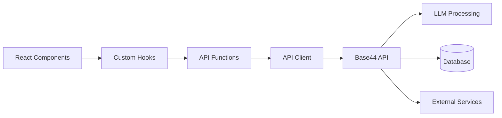

# Base44 API Integration Guide

> **Comprehensive documentation for integrating with the Base44 API in the Privacy Protocol React application**

## Table of Contents

- [Overview](#overview)
- [API Client Architecture](#api-client-architecture)
- [Authentication](#authentication)
- [Core API Functions](#core-api-functions)
- [Data Models](#data-models)
- [External Integrations](#external-integrations)
- [Error Handling](#error-handling)
- [Caching Strategy](#caching-strategy)
- [Usage Patterns](#usage-patterns)
- [Testing API Integration](#testing-api-integration)

## Overview

The Privacy Protocol React application communicates exclusively with the Base44 API for all data processing, analysis, and business logic. The React frontend serves as a sophisticated UI layer while the Base44 API handles:

- Privacy policy analysis and risk scoring
- Large Language Model (LLM) processing
- User authentication and session management
- Subscription and payment processing
- Community analytics and benchmarking
- File processing and content extraction

### API Architecture Flow



## API Client Architecture

### Core API Client (`src/api/apiClient.js`)

The API client provides a centralized interface for all Base44 API communication:

```javascript
import { createBase44Client } from '@base44/sdk';

// Initialize Base44 client with configuration
export const base44 = createBase44Client({
  baseURL: process.env.VITE_BASE44_API_URL || 'https://api.base44.com',
  timeout: 30000,
  retries: 3,
  retryDelay: 1000
});

// Standardized request wrapper with error handling
export async function apiRequest(apiCall, options = {}) {
  const {
    successMessage,
    errorMessage = 'An error occurred',
    showLoading = true,
    showSuccess = true
  } = options;

  try {
    if (showLoading) {
      // Show loading indicator
    }

    const result = await apiCall();

    if (showSuccess && successMessage) {
      // Show success notification
    }

    return result;
  } catch (error) {
    // Handle and display error
    console.error('API Request Error:', error);
    throw error;
  }
}
```

### Request/Response Interceptors

The API client includes automatic request and response processing:

```javascript
// Request interceptor - adds authentication headers
base44.interceptors.request.use((config) => {
  const token = localStorage.getItem('auth_token');
  if (token) {
    config.headers.Authorization = `Bearer ${token}`;
  }
  return config;
});

// Response interceptor - handles common errors
base44.interceptors.response.use(
  (response) => response,
  (error) => {
    if (error.response?.status === 401) {
      // Handle authentication errors
      logout();
    }
    return Promise.reject(error);
  }
);
```

## Authentication

### Session Management

The Base44 API handles user authentication through JWT tokens:

```javascript
// Check user session status
export async function checkSession() {
  return apiRequest(
    () => base44.auth.validateSession(),
    { showLoading: false }
  );
}

// Login user
export async function loginUser(credentials) {
  return apiRequest(
    () => base44.auth.login(credentials),
    { successMessage: 'Login successful' }
  );
}

// Logout user
export async function logoutUser() {
  return apiRequest(
    () => base44.auth.logout(),
    { successMessage: 'Logged out successfully' }
  );
}
```

### Usage in React Components

```jsx
import { useAuth } from '@/contexts/AuthContext';

function ProtectedComponent() {
  const { user, login, logout, loading } = useAuth();
  
  if (loading) return <LoadingSpinner />;
  if (!user) return <LoginForm onLogin={login} />;
  
  return <div>Protected content for {user.name}</div>;
}
```

## Core API Functions

### 1. Policy Analysis Functions

#### `riskScoreCalculator`

**Endpoint**: `POST /api/v1/analyze/risk-score`

**Purpose**: Calculates comprehensive privacy risk scores for policy documents

**Request Payload**:
```typescript
interface RiskScoreRequest {
  content: string;                    // Privacy policy text content
  url?: string;                      // Optional policy URL
  company_name: string;              // Company name for context
  user_profile?: {                   // User preferences for personalized scoring
    privacy_tolerance: 'strict' | 'moderate' | 'relaxed';
    data_sensitivity: string[];
    industry_context?: string;
  };
}
```

**Response Structure**:
```typescript
interface RiskScoreResult {
  risk_score: number;                // Overall risk score (0-100)
  risk_level: 'low' | 'medium' | 'high' | 'critical';
  flagged_clauses: FlaggedClause[];  // Problematic clauses identified
  data_collection_breakdown: {       // Data collection analysis
    contact_info: boolean;
    financial_data: boolean;
    health_data: boolean;
    biometric_data: boolean;
    location_data: boolean;
    behavioral_data: boolean;
  };
  user_rights_summary: {             // User rights analysis
    data_access: boolean;
    data_deletion: boolean;
    data_portability: boolean;
    opt_out_options: boolean;
    consent_withdrawal: boolean;
  };
  third_party_trackers: string[];    // Identified third-party services
  recommendations: Recommendation[]; // Personalized recommendations
  analysis_metadata: {
    processed_at: string;
    processing_time_ms: number;
    confidence_score: number;
  };
}
```

**React Usage**:
```jsx
import { useApiQuery } from '@/hooks';
import { riskScoreCalculator } from '@/api/functions';

function AnalysisResults({ policyContent, companyName }) {
  const { data: riskAnalysis, loading, error } = useApiQuery(
    'riskScore',
    () => riskScoreCalculator({
      content: policyContent,
      company_name: companyName,
      user_profile: userProfile
    }),
    { enabled: !!policyContent }
  );

  if (loading) return <AnalysisLoading />;
  if (error) return <ErrorDisplay error={error} />;

  return <RiskScoreDisplay analysis={riskAnalysis} />;
}
```

#### `policyMonitor`

**Endpoint**: `POST /api/v1/monitor/policy`

**Purpose**: Sets up automated monitoring for privacy policy changes

**Request Payload**:
```typescript
interface PolicyMonitorRequest {
  url: string;                       // Policy URL to monitor
  company_name: string;              // Company identifier
  frequency: 'daily' | 'weekly' | 'monthly';
  notify_changes: boolean;           // Send notifications on changes
  user_id: string;                   // User setting up monitoring
}
```

**Response Structure**:
```typescript
interface PolicyMonitorResult {
  monitor_id: string;                // Unique monitoring ID
  status: 'active' | 'pending' | 'failed';
  next_check: string;                // ISO date of next check
  baseline_hash: string;             // Hash of current policy version
  monitoring_config: {
    frequency: string;
    notifications_enabled: boolean;
    change_threshold: number;        // Minimum change % to trigger alert
  };
}
```

### 2. Subscription Management Functions

#### `subscriptionManager`

**Endpoint**: `POST /api/v1/subscription/manage`

**Purpose**: Handles all subscription lifecycle operations

**Request Payload**:
```typescript
interface SubscriptionRequest {
  action: 'create' | 'update' | 'cancel' | 'check_limits' | 'get_usage';
  plan_id?: string;                  // For create/update actions
  payment_method?: {
    type: 'stripe' | 'paypal';
    token: string;
  };
  user_id: string;
}
```

**Response Structure**:
```typescript
interface SubscriptionResult {
  subscription: {
    id: string;
    plan_id: string;
    status: 'active' | 'canceled' | 'past_due';
    current_period_start: string;
    current_period_end: string;
    cancel_at_period_end: boolean;
  };
  usage_limits: {
    analyses_per_month: number;
    monitoring_slots: number;
    export_credits: number;
    api_calls_per_day: number;
  };
  current_usage: {
    analyses_used: number;
    monitors_active: number;
    exports_used: number;
    api_calls_today: number;
  };
  features: {
    advanced_analytics: boolean;
    priority_support: boolean;
    custom_integrations: boolean;
    white_label_reports: boolean;
  };
}
```

### 3. Community Analytics Functions

#### `communityInsights`

**Endpoint**: `GET /api/v1/insights/community`

**Purpose**: Provides aggregated community privacy statistics and trends

**Query Parameters**:
```typescript
interface CommunityInsightsParams {
  timeframe?: '7d' | '30d' | '90d' | '1y';
  industry?: string;                 // Filter by industry
  region?: string;                   // Geographic filter
  include_trends?: boolean;          // Include trending risks
  anonymized?: boolean;              // Anonymize sensitive data
}
```

**Response Structure**:
```typescript
interface CommunityInsightsResult {
  global_stats: {
    total_analyses: number;
    average_risk_score: number;
    most_common_risks: string[];
    privacy_improvement_trend: number;
  };
  industry_benchmarks: {
    [industry: string]: {
      average_risk_score: number;
      common_practices: string[];
      regulatory_compliance: number;
    };
  };
  trending_risks: {
    risk_type: string;
    prevalence_change: number;       // Percentage change
    affected_companies: number;
    severity_level: 'low' | 'medium' | 'high';
  }[];
  regional_insights: {
    [region: string]: {
      privacy_awareness_score: number;
      regulatory_strength: number;
      common_violations: string[];
    };
  };
}
```

### 4. Notification Functions

#### `notificationEngine`

**Endpoint**: `POST /api/v1/notifications/manage`

**Purpose**: Manages user notifications and communication preferences

**Request Payload**:
```typescript
interface NotificationRequest {
  action: 'send' | 'schedule' | 'update_preferences' | 'get_history';
  type?: 'policy_change' | 'risk_alert' | 'subscription' | 'system';
  content?: {
    title: string;
    message: string;
    action_url?: string;
    priority: 'low' | 'medium' | 'high';
  };
  preferences?: {
    email_notifications: boolean;
    push_notifications: boolean;
    sms_notifications: boolean;
    frequency: 'immediate' | 'daily' | 'weekly';
  };
  user_id: string;
}
```

## Data Models

### Core Entity Definitions (`src/api/entities.js`)

The Base44 API provides structured data models for all entities:

```javascript
// Privacy Agreement entity
export const PrivacyAgreement = base44.entities.PrivacyAgreement;
/*
Structure:
{
  id: string;
  title: string;
  company_name: string;
  url?: string;
  content: string;
  risk_score: number;
  analysis_date: string;
  flagged_clauses: FlaggedClause[];
  data_collection_breakdown: DataBreakdown;
  user_rights_summary: UserRights;
  recommendations: Recommendation[];
}
*/

// User Privacy Profile entity
export const UserPrivacyProfile = base44.entities.UserPrivacyProfile;
/*
Structure:
{
  user_id: string;
  privacy_tolerance: 'strict' | 'moderate' | 'relaxed';
  data_sharing_preferences: string[];
  notification_preferences: NotificationPrefs;
  industry_context?: string;
  created_at: string;
  updated_at: string;
}
*/

// Policy Change entity
export const PolicyChange = base44.entities.PolicyChange;
/*
Structure:
{
  id: string;
  monitor_id: string;
  detected_at: string;
  change_type: 'minor' | 'major' | 'critical';
  change_summary: string;
  affected_sections: string[];
  risk_impact: number;
  notification_sent: boolean;
}
*/
```

### Custom Data Types

```typescript
interface FlaggedClause {
  clause_text: string;
  risk_level: 'low' | 'medium' | 'high' | 'critical';
  category: 'data_collection' | 'data_sharing' | 'user_rights' | 'retention';
  explanation: string;
  recommendation: string;
  legal_basis?: string;
}

interface Recommendation {
  type: 'action' | 'awareness' | 'setting';
  priority: 'low' | 'medium' | 'high';
  title: string;
  description: string;
  action_url?: string;
  estimated_impact: number;
}

interface DataBreakdown {
  categories: {
    [category: string]: {
      collected: boolean;
      purpose: string[];
      retention_period?: string;
      third_party_sharing: boolean;
    };
  };
  total_data_points: number;
  sensitivity_score: number;
}
```

## External Integrations

### Base44 Integration Services (`src/api/integrations.js`)

The Base44 API provides access to external services through standardized integrations:

```javascript
// Large Language Model integration
export const InvokeLLM = base44.integrations.Core.InvokeLLM;
/*
Usage: Process natural language text with AI models
Parameters: {
  prompt: string;
  model: 'gpt-4' | 'claude-3' | 'custom';
  temperature: number;
  max_tokens: number;
}
*/

// Email service integration
export const SendEmail = base44.integrations.Core.SendEmail;
/*
Usage: Send transactional and notification emails
Parameters: {
  to: string[];
  subject: string;
  template: string;
  variables: object;
}
*/

// File processing integration
export const UploadFile = base44.integrations.Core.UploadFile;
/*
Usage: Upload and process documents
Parameters: {
  file: File;
  type: 'pdf' | 'doc' | 'txt';
  extract_text: boolean;
}
*/

// Data extraction integration
export const ExtractDataFromUploadedFile = base44.integrations.Core.ExtractDataFromUploadedFile;
/*
Usage: Extract structured data from uploaded documents
Parameters: {
  file_id: string;
  extraction_type: 'privacy_policy' | 'terms_of_service';
  language: string;
}
*/
```

### Integration Usage Patterns

```jsx
// File upload and analysis workflow
async function analyzeUploadedPolicy(file) {
  try {
    // 1. Upload file to Base44
    const uploadResult = await UploadFile({
      file,
      type: 'pdf',
      extract_text: true
    });

    // 2. Extract policy content
    const extractionResult = await ExtractDataFromUploadedFile({
      file_id: uploadResult.file_id,
      extraction_type: 'privacy_policy',
      language: 'en'
    });

    // 3. Analyze extracted content
    const analysisResult = await riskScoreCalculator({
      content: extractionResult.extracted_text,
      company_name: extractionResult.detected_company || 'Unknown'
    });

    return analysisResult;
  } catch (error) {
    console.error('File analysis failed:', error);
    throw error;
  }
}
```

## Error Handling

### Error Types and Handling

The Base44 API returns structured error responses that the React application handles consistently:

```typescript
interface APIError {
  code: string;                      // Error code (e.g., 'RATE_LIMIT_EXCEEDED')
  message: string;                   // Human-readable error message
  details?: object;                  // Additional error context
  retry_after?: number;              // Seconds to wait before retry
  documentation_url?: string;        // Link to relevant documentation
}
```

### Error Handling in React Components

```jsx
import { useApiQuery } from '@/hooks';
import { Alert } from '@/components/ui';

function ComponentWithErrorHandling() {
  const { data, loading, error } = useApiQuery('endpoint');

  if (loading) return <LoadingSpinner />;
  
  if (error) {
    return (
      <Alert variant="destructive">
        <AlertTitle>Error</AlertTitle>
        <AlertDescription>
          {error.message || 'An unexpected error occurred'}
        </AlertDescription>
      </Alert>
    );
  }

  return <DataDisplay data={data} />;
}
```

### Common Error Scenarios

1. **Rate Limiting**: When API usage limits are exceeded
2. **Authentication Errors**: Invalid or expired tokens
3. **Validation Errors**: Invalid request parameters
4. **Service Unavailable**: Base44 API maintenance or outages
5. **Network Errors**: Connection timeouts or failures

## Caching Strategy

### Multi-Level Caching Architecture

The React application implements intelligent caching to optimize performance:

```javascript
// API Response Cache (src/hooks/use-api-query.js)
const cache = new Map();

export function useApiQuery(key, queryFn, options = {}) {
  const [data, setData] = useState(cache.get(key));
  const [loading, setLoading] = useState(!cache.has(key));
  const [error, setError] = useState(null);

  useEffect(() => {
    if (options.enabled === false) return;

    const fetchData = async () => {
      try {
        setLoading(true);
        const result = await queryFn();
        cache.set(key, result);
        setData(result);
      } catch (err) {
        setError(err);
      } finally {
        setLoading(false);
      }
    };

    fetchData();
  }, [key, options.enabled]);

  return { data, loading, error };
}
```

### Cache Invalidation Strategies

```javascript
// Invalidate cache on data mutations
export function useApiMutation(mutationFn, options = {}) {
  const [loading, setLoading] = useState(false);
  
  const mutate = async (variables) => {
    setLoading(true);
    try {
      const result = await mutationFn(variables);
      
      // Invalidate related cache entries
      if (options.invalidateKeys) {
        options.invalidateKeys.forEach(key => cache.delete(key));
      }
      
      return result;
    } finally {
      setLoading(false);
    }
  };

  return { mutate, loading };
}
```

## Usage Patterns

### 1. Standard API Query Pattern

```jsx
import { useApiQuery } from '@/hooks';
import { riskScoreCalculator } from '@/api/functions';

function PolicyAnalysis({ policyContent }) {
  const { data, loading, error } = useApiQuery(
    ['analysis', policyContent],
    () => riskScoreCalculator({ content: policyContent }),
    { enabled: !!policyContent }
  );

  return (
    <div>
      {loading && <LoadingSpinner />}
      {error && <ErrorMessage error={error} />}
      {data && <AnalysisResults data={data} />}
    </div>
  );
}
```

### 2. Mutation with Optimistic Updates

```jsx
import { useApiMutation } from '@/hooks';
import { subscriptionManager } from '@/api/functions';

function SubscriptionUpgrade() {
  const { mutate: upgradeSubscription, loading } = useApiMutation(
    (planId) => subscriptionManager({ action: 'update', plan_id: planId }),
    {
      onSuccess: () => {
        showNotification('Subscription upgraded successfully!');
      },
      invalidateKeys: ['subscription', 'usage']
    }
  );

  return (
    <Button 
      onClick={() => upgradeSubscription('premium')}
      loading={loading}
    >
      Upgrade to Premium
    </Button>
  );
}
```

### 3. Real-time Data Updates

```jsx
import { useEffect } from 'react';
import { useApiQuery } from '@/hooks';

function RealTimeInsights() {
  const { data, refetch } = useApiQuery('communityInsights', communityInsights);

  useEffect(() => {
    const interval = setInterval(() => {
      refetch();
    }, 30000); // Refresh every 30 seconds

    return () => clearInterval(interval);
  }, [refetch]);

  return <InsightsDisplay data={data} />;
}
```

## Testing API Integration

### Mock API Responses

```javascript
// tests/mocks/api.js
import { rest } from 'msw';

export const handlers = [
  rest.post('/api/v1/analyze/risk-score', (req, res, ctx) => {
    return res(
      ctx.json({
        risk_score: 75,
        risk_level: 'high',
        flagged_clauses: [
          {
            clause_text: 'We may share your data with third parties',
            risk_level: 'high',
            category: 'data_sharing'
          }
        ]
      })
    );
  }),

  rest.get('/api/v1/insights/community', (req, res, ctx) => {
    return res(
      ctx.json({
        global_stats: {
          total_analyses: 10000,
          average_risk_score: 65
        }
      })
    );
  })
];
```

### Integration Tests

```javascript
// tests/integration/api.test.js
import { render, screen, waitFor } from '@testing-library/react';
import { server } from '../mocks/server';
import { PolicyAnalysis } from '../components/PolicyAnalysis';

describe('API Integration', () => {
  beforeAll(() => server.listen());
  afterEach(() => server.resetHandlers());
  afterAll(() => server.close());

  test('displays analysis results', async () => {
    render(<PolicyAnalysis policyContent="Sample policy text" />);

    await waitFor(() => {
      expect(screen.getByText('Risk Score: 75')).toBeInTheDocument();
    });
  });

  test('handles API errors gracefully', async () => {
    server.use(
      rest.post('/api/v1/analyze/risk-score', (req, res, ctx) => {
        return res(ctx.status(500), ctx.json({ message: 'Server error' }));
      })
    );

    render(<PolicyAnalysis policyContent="Sample policy text" />);

    await waitFor(() => {
      expect(screen.getByText('Server error')).toBeInTheDocument();
    });
  });
});
```

---

## API Endpoint Reference

### Complete Endpoint List

| Endpoint | Method | Purpose | React Usage |
|----------|--------|---------|-------------|
| `/api/v1/analyze/risk-score` | POST | Calculate privacy risk scores | `riskScoreCalculator()` |
| `/api/v1/monitor/policy` | POST | Setup policy monitoring | `policyMonitor()` |
| `/api/v1/subscription/manage` | POST | Manage subscriptions | `subscriptionManager()` |
| `/api/v1/insights/community` | GET | Community analytics | `communityInsights()` |
| `/api/v1/notifications/manage` | POST | Notification management | `notificationEngine()` |
| `/api/v1/payments/paypal` | POST | PayPal payment processing | `paypalManager()` |
| `/api/v1/auth/login` | POST | User authentication | `base44.auth.login()` |
| `/api/v1/auth/logout` | POST | User logout | `base44.auth.logout()` |
| `/api/v1/files/upload` | POST | File upload | `UploadFile()` |
| `/api/v1/files/extract` | POST | Content extraction | `ExtractDataFromUploadedFile()` |

### Rate Limits and Quotas

- **Free Tier**: 10 analyses/month, 1 monitor, 100 API calls/day
- **Premium Tier**: 100 analyses/month, 10 monitors, 1000 API calls/day
- **Enterprise Tier**: Unlimited analyses, unlimited monitors, 10000 API calls/day

### Authentication Requirements

All API endpoints require authentication except:
- Public community insights (anonymized)
- Health check endpoints
- Documentation endpoints

---

*This API integration guide is maintained by the Privacy Protocol development team. For questions about specific endpoints or integration patterns, please refer to the Base44 API documentation or create an issue in the repository.*
